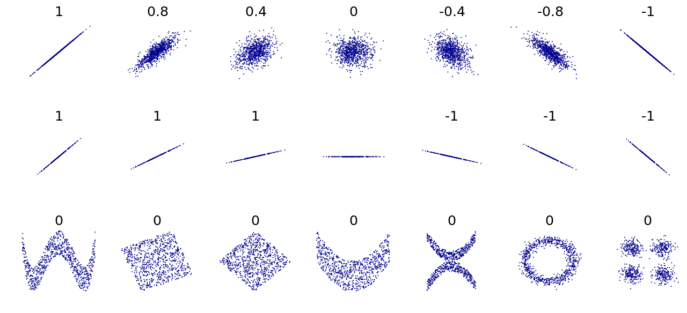
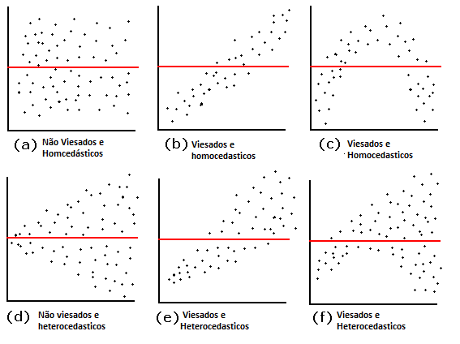

# 1. Análise de Correlação

## Análise e Coeficiente de Correlação
\metroset{block=fill}

\begin{block}{Objetivo}	
A Análise de Correlação mede a força da \textbf{relação linear}
entre variáveis numéricas. A medida baseia-se no coeficiente de correlação
entre duas variáveis aleatórias.

- Covariância

$$
\begin{aligned}	
Cov(X,Y) &= E[(X - \mu_X)(Y - \mu_Y)], \\
         &= E[XY] - \mu_X \mu_Y
\end{aligned}
$$
- Correlação

$$
Cor(X,Y) = \rho_{xy} = \frac{Cov(X,Y)}{\sigma_X \sigma_Y} \,\, (-1 \leq \rho_{xy} \leq +1)
$$
\end{block}	


## Coeficientes de Correlação: Estimadores

\metroset{block=fill}

\begin{block}{Coeficiente de Correlação de Pearson}	
\begin{equation*}
r  = \frac{\sum_{i=1}^{n} (x_i - \bar{x}) (y_i - \bar{y})}{\sqrt{\sum_{i=1}^{n} (x_i - \bar{x})^2} \sqrt{\sum_{i=1}^{n} (y_i - \bar{y})^2}  }
\end{equation*}	
Sendo $x_i$ e $y_i$ os dados ou observações. \pause \textbf{Pressuposto:} 
Distribuição aproximandamente normal. \pause Sensível a valores extremos.	
\end{block}	

\pause
\begin{block}{Coeficiente de Correlação de Spearman}	
\begin{equation*}
r  = 1 - \frac{6\sum_{i=1}^{n} (x_i - y_i)^2}{n(n^2 - 1)}
\end{equation*}	
Sendo $x_i$ e $y_i$ os postos (\textit{rank}) das observações. \pause 
\textbf{Método não paramétrico:} robusto a outliers. menor 
poder do teste.
\end{block}


## Correlação: Gráficos de Dispersão

```{r fig01, out.width = "95%", echo = FALSE, fig.align = 'center'}

```


## Correlação: Gráficos de Dispersão

```{r fig01a, out.width = "90%", echo = FALSE, fig.align = 'center'}

```

- [Leia wikipedia](https://en.wikipedia.org/wiki/Pearson_correlation_coefficient) 


## Níveis de Correlação: "Regra de Bolso"

\centering
\begin{tabular}{|c|c|}
	\hline 
	\hline
    $\mathbf{r}$ 	                  & \textbf{Magnitude}         \\ 
	\hline 
.80 to 1.00 (-.80 to -1.00)	& Correlação muito forte     \\ 
	\hline 
.30 to .80 (-.30 to -.80) 	& Correlação moderada        \\ 
	\hline 
.00 to .30 (.00 to -.30) 	  & Correlação fraca            \\ 
	\hline 
	\hline
\end{tabular} 


## Cuidado! Quarteto de Anscombe

```{r fig02, out.width = "60%", echo = FALSE, fig.align='center'}
knitr::include_graphics("img/fig02.png")
```

[Leia Wikipedia](https://en.wikipedia.org/wiki/Anscombe%27s_quartet)


## Cuidado!

\metroset{block=fill}

\begin{alertblock}{Cuidado!}
	
Um coeficiente de correlação (Pearson ou Spearman) indica a força da relação 
linear entre duas variáveis, mas seu valor geralmente não caracteriza 
completamente a relação, caso exista, entre duas variáveis. Por exemplo, 
pode haver uma relação não-linear entre as variáveis.
\end{alertblock}

\pause 

\begin{alertblock}{Cuidado!}
	
uma medida estatística que sumariza a informação dos dados, não pode 
substituir o exame visual dos dados.
\end{alertblock}


## Correlação: Inferência

\metroset{block=fill}

\begin{block}{Teste para $r$ - Pearson}
\begin{align*}
H_0:\,\, & \rho = 0    \\
H_A:\,\, & \rho \neq 0	\\
t    & = \frac{r \sqrt{n - 2}}{\sqrt{1 - r^2}}  \sim t_{(n-2,\alpha)}
\end{align*}	

Usando um software estatístico, é fácil calcular a probabilidade de observar 
um valor igual o maior que $|t|$. Essa probabilidade recebe o nome de 
\textbf{valor-p}.

\begin{description}
\item[Se valor-p $<$ 0.05] A estimativa \textbf{é} estatisticamente diferente 
     de zero.

\item[Se valor-p $>$ 0.05] A estimativa \textbf{não é} estatisticamente 
     diferente de zero.
\end{description}

\textbf{Melhor}: Intervalo de Confiança para $\rho$
\end{block}


## Análise de Correlação: Sumário

\begin{itemize}[<+-| alert@+>]
\item A análise de correlação é usada para avaliar a \alert{\textbf{força e direção 
      das relações lineares}} entre pares de variáveis
	
\item Se as variáveis forem numéricas, contínuas e normalmente distribuídas, 
      use o coeficiente de Pearson
	
\item Se as variáveis forem medidas usando uma escala ordinal ou tiverem      
      distribuições assimétricas e/ou outliers (i.e, não normalidade), 
      utilize o coeficiente de Spearman.
	
\item Relações identificadas utilizando coeficientes de correlação devem ser        
      interpretadas por aquilo que são: \textbf{associações}, 
      \alert{\textbf{não como relações de causa e efeito}}
\end{itemize}


## Tutorial: Correlação

\metroset{block=fill}

\begin{block}{Questões}	
\begin{enumerate}
  \item Acessar: \url{https://colab.to/r}
  \item Usando o pacote `BatchGetSymbols` importe dados dos últimos 
        4 meses sobre as seguintes ações: `AAPL`, `MSFT`, `AMZN`, `GOOG`.
	\item Faça uma análise gráfica da correlação entre os preços de 
	      fechamento das ações
	\item Encontre a matriz de correlações entre as variáveis
	\item Obtenha estimativas pontuais de $r$ entre os preços das ações e  
	      teste a hipótese nula de que $r = 0$.
	\item Quais ações possuem correlações estatisticamente 
	      significativas entre os preços?  
\end{enumerate} 
\end{block}


# 2. Modelos de Regressão Linear


## Introdução
\metroset{block=fill}

\begin{block}{Referência}
Gareth et al.~(2013): Introduction to Statistical Learning, 2013. Versão 
gratuita disponível em: \url{https://www.statlearning.com/}
\end{block}

\begin{block}{Regressão e Supervised Learning}
Regressão linear é uma abordagem simples para aprendizagem supervisionada 
(\textbf{supervised learning}). Assume que a dependência de $Y$ em relação 
a $X_1, X_2,\ldots,X_p$ é linear. 
\end{block}

\begin{block}{É uma aproximação}
Funções de regressão verdadeiras nunca são lineares!
\end{block}

\begin{block}{Simples e Útil}
Embora possa parecer muito simplista, a regressão linear é
extremamente útil, conceitualmente e praticamente. 
\end{block}


## IA: Statistics + Machine Learning

```{r j1, out.width = "60%", echo = FALSE, fig.align='center'}

```


## IA: Statistics + Machine Learning

```{r j2, out.width = "60%", echo = FALSE, fig.align='center'}

```


## Regressão Linear para Advertising Data

Considere os dados de publicidade mostrados no próximo slide.

Perguntas que podemos fazer:

\begin{itemize}[<+-| alert@+>]
\item Existe uma relação entre o orçamento de publicidade e vendas?
\item Quão forte é a relação entre o orçamento de publicidade e vendas?
\item Quais mídias contribuem para as vendas?
\item Com que precisão podemos prever as vendas futuras?
\item A relação é linear?
\item Existe sinergia entre as mídias publicitárias?
\end{itemize}


## Advertising Data

```{r advert, out.width = "95%", echo = FALSE, fig.align = 'center'}
knitr::include_graphics("img/adver.png")
```


## Modelos de Regressão:

\metroset{block=fill}

\begin{block}{São utilizados para descrever uma relação entre:}
\begin{itemize}
	
\item Uma variável \alert{resposta} $Y$ (numérica, contínua) e
	
\item Uma ou mais variáveis \alert{preditoras} $X_1,X_2,\ldots,X_p$
	
	\begin{enumerate}
   	\item $p = 1$: Regressão Simples 
	  \item $p > 1$: Regressão Múltipla   
	\end{enumerate}
	
\end{itemize}
\end{block}


## Modelos de Regressão

\metroset{block=fill}

\begin{block}{Variável Resposta}	
Em modelos de regressão a variável resposta $Y$ é \textbf{aleatória, numérica 
contínua}. $Y$ pode ser numérica discreta ou categórica, nesse caso devemos 
usar uma classe mais ampla de modelos.
\end{block}	

\pause
\begin{block}{Variável Resposta}	
Quando a resposta $Y$ é discreta ou categórica, devemos aplicar os 
\textbf{Modelos Lineares Generalizados}.
\end{block}

\pause
\begin{block}{Variáveis Preditoras}	
As variáveis preditoras $X_1,X_2,\ldots,X_k$ sao \textbf{fixas} e podem ser 
\alert{contínuas}, \alert{discretas} ou \alert{categóricas}.
\end{block}


## Modelos de Regressão Simples e Múltipla

\metroset{block=fill}

\begin{block}{Regressão Simples}
\begin{align*}
Y_{i} &= \beta_0 + \beta_1 X_1 + \epsilon_{i} \\
i &= (1,\ldots,n)  \\
\epsilon_{i} &\sim N(0,\sigma^2)
\end{align*}			
\end{block}		

\pause
\begin{block}{Regressão Múltipla}	
\begin{align*}
Y_{i}        &= \beta_0 + \beta_1 X_{1} + \beta_2 X_{2} + \ldots + \beta_p X_{p} + \epsilon_{i} \\
\epsilon_{i} &\sim N(0,\sigma^2)\,\,i = (1,\ldots,n) \\
(p - 1)  &\,\,\text{variáveis preditoras} \,\,(X_1,X_2,\ldots,X_p)
\end{align*}	
\end{block}


## Forma Matricial

\metroset{block=fill}

\begin{equation*}
Y = X\beta + \epsilon
\end{equation*}

```{r fig06, out.width = "60%", echo = FALSE, fig.align='center'}

```


## Modelos de Regressão: $E(Y|X = x)$

\metroset{block=fill}

\begin{block}{Regressão = Valor Esperado Condicional}	
\begin{align*}
E(Y_{i}|X_{1}\ldots X_{p}) &= E(\beta_0 + \beta_1 X_{1} + \ldots + \beta_p X_{p} + \epsilon_{i}) \\
E(Y_{i}|X_{1}\ldots X_{p}) &= \hat{Y}_{i} =\hat{\beta}_o + \hat{\beta_1} X_{1} + 
\ldots + \hat{\beta_p} X_{p} \\
\hat{\epsilon}_{i} &= Y_{i} - \hat{Y}_{i} \sim N(0,\sigma^2)
\end{align*}

$\epsilon$ = erro 

$\hat{\epsilon}$ = resíduo
\end{block}


## Modelos de Regressão: $E(Y|X = x)$

```{r condicional, out.width = "90%", echo = FALSE, fig.align='center'}
knitr::include_graphics("img/condicional.png")
```


## Estimação dos Parâmetros por Mínimos Quadrados Ordinários

\metroset{block=fill}

\begin{block}{Método dos Mínimos Quadrados Ordinários}
Pelo método dos MQO, desejamos encontrar a equação da reta/plano que melhor 
se ``ajusta'' aos dados. Isto implica em encontrar estimadores de $\beta_1,\beta_2,\ldots,\beta_p$ que minimizam a soma de quadrado dos resíduos:	
\end{block}

\begin{align*}
\hat{\epsilon_i} &= y_i - \hat{y_i} \\
\sum \hat{\epsilon_i}^2 &= \sum (y_i - \hat{y_i})^2 \\
Min	& \sum_{i=1}^{n} (y_i - \beta_0 - \beta_1 X_{i1} - \beta_2 X_{i2} - \ldots - \beta_p X_{ip})^2 \\
Min & \,\, \hat{\epsilon_i}^{t} \hat{\epsilon_i} = (X\hat{\beta} - Y)^t(X\hat{\beta} - Y)
\end{align*}	


## Geometria dos Mínimos Quadrados Ordinários

```{r least, out.width = "60%", echo = FALSE, fig.align='center'}
knitr::include_graphics("img/leastsq.png")
```


## Estimadores de MQO dos parâmetros

\metroset{block=fill}

\begin{block}{Regressão Simples}
\begin{align*}
\hat{\beta_1} &= \frac{\sum(y_i - \bar{y})(x_i - \bar{x})}{\sum (x_i - \bar{x})^2} \\
\hat{\beta_0} &= \bar{y} - \hat{\beta}\bar{x}
\end{align*}
\end{block}	
	
\begin{block}{Regressão Múltipla - Matrizes}
\begin{equation*}
\hat{\beta} = 
\begin{bmatrix}
\hat{\beta_0} \\
\hat{\beta_1} \\
\vdots
\hat{\beta_p}  
\end{bmatrix}
= 
(X'X)^{-1}X'Y
\end{equation*}
\end{block}	


## Estimação: Regressão Linear Simples

```{r line, out.width = "60%", echo = FALSE, fig.align='center'}
knitr::include_graphics("img/fitline.png")
```

- Ajuste de MQ da regressão de `Sales` contra `Tv`

- Neste caso, o modelo linear captura a essência do relação,
  embora seja um pouco deficiente nos dados iniciais (esquerda do 
  gráfico). 


## Estimação: Regressão Linear Múltipla

```{r plano, out.width = "60%", echo = FALSE, fig.align='center'}
knitr::include_graphics("img/plano.png")
```


## 4. Modelos de Regressão em R

```{r fig08a, out.width = "90%", echo = FALSE, fig.align='center'}
knitr::include_graphics("img/fig08.png")
```


## Avaliação da Acurácia das estimativas dos parâmetros

\metroset{block=fill}

\begin{block}{Estimadores dos Parâmetros do modelo}	

\begin{equation*}
\hat{\beta} =  (X'X)^{-1}X'Y
\end{equation*}
\end{block}

\begin{block}{Estimador da variância do erro}
	
\begin{equation*}
\hat{\sigma}^2 =  \frac{(Y - X\hat{\beta})'(Y - X\hat{\beta})}{n - p} 
\end{equation*}
\end{block}

\begin{block}{Estimador da Matriz de Variância-Covariância dos Parâmetros}

\begin{equation*}
V(\hat{\beta}) = \hat{\sigma}^2  (X'X)^{-1} = \hat{\sigma}^2
\begin{bmatrix}
V(\hat{\beta_0})                    &                                   &                     \\
COV(\hat{\beta_0},\hat{\beta_1})    & V(\hat{\beta_1})                  &                     \\
COV(\hat{\beta_0},\hat{\beta_2})    & COV(\hat{\beta_1},\hat{\beta_2})  & V(\hat{\beta_2})
\end{bmatrix}
\end{equation*}	
\end{block}


## Avaliação da Acurácia das estimativas dos parâmetros

\metroset{block=fill}

\begin{block}{Erro Padrão de um Parâmetro}
Estimador do erro-padrão dos parâmetros:

\begin{equation*}
EP(\hat{\beta}) = \sqrt{V(\hat{\beta})} = \sigma^2(X^{t}X)^{-1}
\end{equation*} 

Esses erros padrão podem ser usados para calcular \textbf{intervalos de 
confiança}. Um intervalo de confiança (95\%) é definido como um intervalo de
valores tais que com 95% de probabilidade, o intervalo contém o verdadeiro 
valor desconhecido do parâmetro em amostras repetidas. Tem a forma:

\begin{equation*}
\hat{\beta_1} \pm 2 \times EP(\hat{\beta_1})
\end{equation*}
\end{block}


## Intervalos de Confiança

\metroset{block=fill}

\begin{block}{IC para $\beta$}
Isto é, há 95\% de probabilidade que o intervalo:

\begin{equation*}
[\hat{\beta_1} - 2 \times EP(\hat{\beta_1}), \hat{\beta_1} + 2 \times EP(\hat{\beta_1})]
\end{equation*}

conterá o verdadeiro valor de $\beta_1$ (em um cenário onde obtivemos
amostras repetidas como a presente amostra).
\end{block}


## Testes de Hipóteses

\metroset{block=fill}

\begin{block}{Noção Geral}
Erros padrão também podem ser usados para realizar testes de hipóteses
sobre os coeficientes. O teste de hipótese mais comum envolve testar as 
seguintes hipóteses:

$H_0$: Não há evidência de relação entre $X$ e $Y$

$H_A$: Há evidência de relação entre $X$ e $Y$

Matematicamente, isso corresponde a testar:

$H_0: \beta_1 = 0$

$H_0: \beta_1 \neq 0$

Pois se $\beta_1 = 0$, então o modelo de regressão linear simples torna-se 
$Y = \beta_0 + \epsilon$, e não relação entre $X$ e $Y$.
\end{block}


## Testes de Hipóteses: Teste $t$

\metroset{block=fill}

\begin{block}{Teste t: Testa se cada estimativa é diferentes de zero}
\begin{align*}
H_0:\,\, & \beta_p = 0    \\
H_A:\,\, & \beta_p \neq 0	\\
t    & = \frac{\hat{\beta} - 0}{EP(\hat{\beta})}  \sim t_{(n-p,\alpha)}
\end{align*}	

Usando um software estatístico, é fácil calcular a probabilidade de observar 
um valor igual o maior que $|t|$. Essa probabilidade recebe o nome de 
\textbf{valor-p}.

\begin{description}
\item[Se valor-p $<$ 0.05] A estimativa \textbf{é} estatisticamente diferente 
     de zero.

\item[Se valor-p $>$ 0.05] A estimativa \textbf{não é} estatisticamente 
     diferente de zero.
\end{description}
\end{block}


## 3. Testes de Hipóteses: Teste $F$

\metroset{block=fill}

\begin{block}{Teste F: Testa se todas as estimativas dos parâmetros 
              são iguais a zero}

\begin{align*}
H_0:\,\, & \beta_0 = \beta_1 = \ldots = \beta_p = 0   \\
H_A:\,\, & \text{Pelo menos um} \,\, \beta_p \neq 0	\\
F &= \Biggl(\frac{SQ_{total} - SQ_{residuo}}{SQ_{residuo}}\Biggr) \frac{n - p}{p - 1} \sim F_{(q,n-(p+1))}
\end{align*}	

\begin{description}
\item[Se valor-p $<$ 0.05] Pelo menos uma estimativa de um parâmetro é 
                           estatisticamente diferente de zero

\item[Se valor-p $>$ 0.05] Nenhuma estimativa de parâmetro é estatisticamente 
                           diferente de zero 
\end{description}

O teste $F$ é um instrumento para avaliar a acurácia global do modelo.
\end{block}	


## 4. Avaliação da Acurácia Explicativa do Modelo

\metroset{block=fill}

\begin{equation*}
R^2 = \frac{\sum_{i = 1}^{n} (y_{i} - \bar{y})^2 - \sum_{i = 1}^{n} (y_{i} - \hat{y})^2}{\sum_{i = 1}^{n} (y_{i} - \bar{y})^2} = \frac{SQT - SQR}{SQT}
\end{equation*}	

\begin{block}{$R^2$: Coeficiente de Determinação}	
$R^2$ mede a porcentagem da variação total dos dados ($SQT$) que é 
explicada pelo modelo ($SQT - SQR$). 	
\end{block}	

\begin{block}{$R_{ajustado}^2$: Coeficiente de Determinação Ajustado}	
$R_{ajustado}^2$ tem a mesma interpretação. É preferível ao $R^2$.		 	
\end{block}


## 4. Avaliação da Acurácia Preditiva do Modelo

\metroset{block=fill}

\begin{block}{Root-Mean-Square Error}	
$$
 {RMSE} ={\sqrt {\frac {\sum _{t=1}^{n}({\hat {y}}_{i}-y_{i})^{2}}{n}}}
$$
\end{block}

\begin{block}{Mean Absolute Error}	
$$
MAE = \frac{\sum_{i=1}^{n}|{\hat {y}}_{i}-y_{i}|}{n}
$$
\end{block}


## Preditoras Numéricos: Interpretação dos Estimadores

\metroset{block=fill}

\begin{block}{Interpretação de $\hat{\beta}$}
$\frac{\partial \hat{y_{i}}}{\partial X_{i}}  = \beta$ = Efeito médio  
sobre $Y$ do aumento de uma unidade em $X$, \textbf{mantendo todas as outras 
preditoras fixas}. No exemplo dos dados sobre publicidade temos:

$$
sales = \beta_0 + \beta_1\ TV + \beta_2\,radio + \beta_3\ newspaper
$$
\end{block}	


## Preditoras Categóricas/Qualitativas: Interpretação dos Estimadores

\metroset{block=fill}

\begin{block}{Variável Binária ou \textit{Dummy}}

$$
x_i = 
\begin{cases}
1 & \text{se i-ésima pessoa é mulher}, \\
0 & \text{se i-ésima pessoa é homem}
\end{cases}
$$
Modelo resultante:

$$
y_i = \beta_0 + \beta_1\ x_i + \epsilon_i = 
\begin{cases}
\beta_0 + \beta_1 + \epsilon_i & \text{se i-ésima pessoa é mulher},\\
\beta_0 + \epsilon_i & \text{se i-ésima pessoa é homem}
\end{cases}
$$
\textbf{Interpretação}: $\beta_1$ é a diferença média em $y_i$ entre a categoria 
para a qual $x_i = 0$ (o nível/categoria de referência) e a 
categoria para a qual $x_i = 1$ (o nível/categoria de comparação). 

\end{block}	


## Modelos com Interação: Interpretação dos Estimadores

\metroset{block=fill}

\begin{block}{Interpretação de $\hat{\beta}$ com interação}
 
 $$
 \begin{aligned}
 Y_i &= \beta_0 + \beta_1 X_1 + \beta_2 X_2 + \beta_3 (X_1\times X_2), \\
 sales &= \beta_0 + \beta_1\, TV + \beta_2\,radio + \beta_3\ newspaper + 
         \beta_3 (radio \times TV)
 \end{aligned}
 $$
$$
\begin{aligned}
\frac{\partial sales}{\partial TV}  &= \beta_1 + \beta_3 radio, \\
\frac{\partial sales}{\partial radio}  &= \beta_2 + \beta_3 TV
\end{aligned}
$$ 
\end{block}	


## Logaritmos em modelos de regressão

\begin{tabular}{lllll}
Caso & Especificação & Interpretação de $\beta_1$    \\
\hline
I   & $Y_i = \beta_0 + \beta_1 \ln(X_1) + \epsilon_i$ & A variação de 1\% em $X$ está asscioada a uma \\       &                                                      & variação média de 0,01$\beta_1$ em $Y_i$ \\
II  & $\ln(Y_i) = \beta_0 + \beta_1 X_1 + \epsilon_i$ & A variação de 1 unidade em $X$ está asscioada a \\
    &                                                 &  uma variação média de 100$\beta_1$\% em $Y_i$ \\
III & $\ln(Y_i) = \beta_0 + \beta_1 \ln(X_1) + \epsilon_i$ & A variação de 1\% em $X$ está asscioada a uma \\
    &                                                      & variação média de 100$\beta_1$\% em $Y_i$   \\
\hline
\end{tabular}


## Interpretação dos Estimadores de MQO dos Parâmetros

\metroset{block=fill}

\begin{block}{Cenário ideal: $X$ não correlacionados}

- Dados balanceados

- Cada coeficiente pode ser estimado e testado separadamente.

- Interpretações como \textit{um aumento de uma unidade em  $X_j$ está 
associada com uma mudança de $\beta_j$ em $Y$, enquanto todas as outras 
variáveis permanecem fixas}, são possíveis.
\end{block}	

\begin{block}{Problema: $X$ correlacionados}

- A variância de todas as estimativas dos parâmetros tende a aumentar, 
  às vezes dramaticamente.

- As interpretações tornam-se perigosas - quando $X_j$ muda, tudo muda.
\end{block}

\begin{block}{Cuidado!}
\textbf{Alegações de causalidade devem ser evitadas com dados observacionais}. 
Para fazer jus, designs e modelos específicos devem ser adotados.
\end{block}


## Citações

> **"Essentially, all models are wrong, but some are useful"**. 

George Box


> **"The only way to find out what will happen when a complex system is disturbed is to disturb the system, not merely to observe it passively"**.

Fred Mosteller and John Tukey, paraphrasing George Box


## Statistical Modelling: The Two Cultures

\metroset{block=fill}

\begin{block}{Cultura: Ciência dos Dados/Aprendizagem de Máquina}
Dadas as estimativas $\hat{\beta}_0, \hat{\beta}_1,\ldots,\hat{\beta}_p$ 
o foco está em obter previsões ($\hat{y_i}$). Para modelos de regressão linear, 
pela fórmula:

$$
\hat{y} = \hat{\beta}_0 + \hat{\beta}_1 x_1 + \ldots,\hat{\beta}_p x_p
$$
\end{block}

\begin{block}{Cultura: Científica Tradicional}
Em geral, tem-se um modelo que tenta descrever como $X$ $\rightarrow$ $Y$. 
Na cultura científica tradicional, o intersse em geral está nas estimativas 
$\hat{\beta}_0, \hat{\beta}_1,\ldots,\hat{\beta}_p$. Exemplo: CAPM.

$$
E(R_{i})=R_{f}+\beta _{im}(E(R_{m})-R_{f})
$$
\end{block}


## Premissas do Modelo Clássico de Regressão Linear 

\begin{tabular}{l|l}
\hline
Hipótese                             &  Interpretação            \\
\hline
H1. $E(\epsilon_i) = 0$              & erros tem média 0       \\
H2. $V(\epsilon_i) = \sigma^2$       & variância constante        \\

H3. $Cov(\epsilon_i,\epsilon_i) = 0$ & erros não correlacionados        \\
H4. $Cov(\epsilon_i,x_i) = 0$        & Não há correlação entre $\epsilon_i$ e $x_i$ \\
H5: $\epsilon_i \sim N(0,\sigma^2)$  & erros tem distr. aprox. normal.   \\
\hline
\end{tabular}


## Premissas do Modelo Clássico de Regressão Linear 

\metroset{block=fill}

\begin{block}{H1, H2, H3 e H4}	
Garantem que os estimadores de MQO são os \alert{melhores estimadores lineares 
não viesados}. 
\end{block}

\pause	
\begin{block}{H5}		
Necessária para fazermos inferências (testes de hipóteses, intervalos de 
confiança, intervalos de previsão) sobre os parâmetros do modelo $(\beta_0,\beta_1,\ldots,\beta_p)$	
\end{block}


## Etapas Típicas da Modelagem

\metroset{block=fill}

\begin{block}{Etapas:}	
\begin{enumerate}
\item Prepação dos Dados
\item Análise Exploratória dos Dados
\item Estimação dos Parâmetros do modelo
\item Seleção de Modelos 
\item Diagnóstico do Modelo
\item Análise/Interpretação das Estimativas dos parâmetros e/ou 
\item Previsão  
\end{enumerate}
\end{block}


## 2. Análise Exploratória dos Dados

\metroset{block=fill}

\begin{block}{Antes de qualquer análise, os dados deve ser inspecionados sobre:}

\begin{itemize}
	\item Erros nos dados
	\item Dados faltantes
	\item Valores Extremos
	\item Padrões inesperados
	\item \alert{Correlações entre as variáveis}
	\item $\vdots$
\end{itemize}
\end{block}


## 3. Seleção de Modelos/Variáveis Preditoras/Feature Engineering

\metroset{block=fill}

\begin{block}{Seleção de Modelos}
\begin{itemize}
\item \textbf{Seleção de modelos} é a tarefa de selecionar um ``melhor'' 
modelo a partir de vários modelos possíveis

\item Muitas vezes não há um modelo teórico que explique determinado fenômeno, 
assim, tenta-se construir um modelo \textbf{empírico}. Nestes casos, 
pode-se pensar na inclusão de muitas variáveis

\item Compromisso entre \textbf{Qualidade do Ajuste} $\times$ 
      \textbf{Complexidade do Modelo} 
      
\item Na abordagem de Ciência dos Dados/Machine Learning, este procedimento 
é denominado \textbf{feature engineering}.
\end{itemize}		
\end{block}


## 3. Seleção de Modelos/Variáveis Preditoras

\metroset{block=fill}

\begin{block}{Regressão Stepwise}
\begin{itemize}
\item É um método para estimar diversos modelos de regressão 
e selecionar as variáveis preditoras que devem ser mantidas. O procedimento 
envolve incluir e retirar cada uma  das variáveis do modelo 
(stepwise bidirecional), e selecionar as que devem ser mantidas de acordo 
com algum critério.

\item  \textbf{Critério de Informação de Akaike}
\end{itemize}		
\end{block}


## 3. Seleção de Modelos/Variáveis Preditoras

\metroset{block=fill}

\begin{block}{Critério de Informação de Akaike}
\begin{itemize}
\item O Critério de Informação de Akaike (AIC) é uma medida relativa da 
qualidade de um modelo estatístico. Isto é, dado um conjunto de modelos para 
os dados, o AIC estima a qualidade de cada modelo, em relação a cada um dos 
outros modelos possíveis. 
 
\item O AIC tem como base a \textbf{Teoria da Informação}, fornece uma 
estimativa relativa da \textbf{informação perdida} quando um determinado 
modelo é usado para representar o processo que gera os dados.
 
\begin{equation*}
AIC = 2K - 2\ln(L)
\end{equation*}	
\end{itemize}	
\end{block}


## 3. Seleção de Modelos/Variáveis Preditoras

\metroset{block=fill}

\begin{block}{Regressão Stepwise no R}
Quanto menor o AIC, menor a ``informação perdida'' pelo modelo em questão. 
Assim, ao selecionar modelos, escolhemos aquele com o menor AIC.	
\end{block}

```{r cod20, eval = FALSE}
## Regressao Stepwise
modelo_final = stepAIC(mcompleto)
summary(modelo_final)
```


## 4. Estimação de Parâmetros e Inferência no R

```{r cod09, eval = FALSE}
# A Funcao lm() estima o modelo	
 modelo = lm(Y ~ X1 + X2 + X3 + ..., data = data frame)	
 
# A funcao summary() exibe os resultados
summary(modelo)       
```


## 4. Estimação de Parâmetros e Inferência no R

```{r fig08, out.width = "90%", echo = FALSE, fig.align='center'}
knitr::include_graphics("img/fig08.png")
```


## 4. Estimação de Parâmetros e Inferência no R 

\metroset{block=fill}

Estimativa de \textbf{Intervalos de Confiança} para os Parâmetros

\metroset{block=fill}

```{r cod10, eval = FALSE}
# estimativas de IC para os parametros
confint(modelo,level=0.95)
```

\begin{alertblock}{Atenção!}

A hipótese de normalidade dos resíduos é importante para a qualidade das 
estimativas destes intervalos
\end{alertblock}


## 4. Estimação de Parâmetros e Inferência no R

\metroset{block=fill}

Estimação de \textbf{Intervalos de Previsão} no R

```{r cod11, eval = FALSE}
## predict = estimativas pontuais e intervalos de previsao 
## para Y 
previsoes <- predict(modelo, dados_teste, interval = "prediction")
```

\begin{alertblock}{Atenção!}

A hipótese de normalidade dos resíduos é importante para a qualidade das 
estimativas destes intervalos
\end{alertblock}


## 5. Diagnóstico do Modelo

\metroset{block=fill}

\begin{block}{Diagnóstico da forma linear do Modelo}

\begin{itemize}[<+-| alert@+>]

\item Diagnóstico da forma linear do Modelo

\begin{itemize}[<+-| alert@+>]
\item $R_{ajustado}^2$: Coeficiente de Determinação Ajustado
\item Teste RESET 
\end{itemize}

\item Diagnóstico dos Resíduos

\begin{itemize}[<+-| alert@+>]
\item Resíduos são não correlacionados? \pause 1) gráfico dos $\hat{\epsilon}_i$ x $\hat{y}_i$, \pause 2) Teste de Durbin-Watson 

\item Resíduos tem Variâncias Homogêneas? \pause 1) gráfico dos $\hat{\epsilon}_i$ x $\hat{y}_i$, \pause 2) teste de Breush-Pagan 

\item Resíduos tem distr. normal? \pause 1) gráfico q-q, \pause 
2) Teste de Jarque-Bera. 

\item Há outliers (valores extremos)? \pause 1) gráfico dos $\hat{\epsilon}_i$ padronizados x $\hat{y}_i$
\end{itemize}

\item Diagnóstico das Variáveis Preditoras ($X$'s): Multicolinearidade

\begin{itemize}[<+-| alert@+>]

\item As variáveis X são correlacionadas? \pause Fator de Inflação da Variância
\end{itemize}
\end{itemize}
\end{block}


## 5. Diagnóstico do Modelo: Teste RESET

\metroset{block=fill}

\begin{block}{Teste de Especificação do Modelo}	
\begin{description}
\item[Teste RESET] É um teste de especificação geral para o modelo de regressão 
linear. Testa se combinações não-lineares dos valores ajustados ajudam a explicar a variável de resposta. A intuição por trás do teste é que, se combinações 
não-lineares dos X's tem qualquer poder para explicar a variável resposta, 
o modelo linear não é adequado.

\item[Regra de Decisão] Valores-p maiores que 0.05 (5\%) implicam que a $H_0$ 
de que o modelo linear é uma especificação adequada. $H_0$ \textbf{não deve 
ser rejeitada}.
\end{description}	
\end{block}


## 5. Diagnóstico do Modelo: Teste RESET

```{r cod12, eval = FALSE}
# Teste RESET no R
library(lmtest)
resettest(modelo, type = "regressor")
```


## 5. Diagnóstico dos Resíduos: Gráfico dos Resíduos x Valores previstos

\metroset{block=fill}
 
 \begin{block}{Gráfico dos Resíduos x Valores previstos}	
 Neste gráfico, podemos verificar:
 \begin{itemize}
 \item H1. $E(\epsilon_i) = 0$  (É também um teste de especificação)
 \item H2. $V(\epsilon_i) = \sigma^2$ (se a variância É homogênea)
 \item H3. $Cov(\epsilon_i,\epsilon_i) = 0$ (se os resíduos são não correlacionados)
 \end{itemize}	
 \end{block}
 
```{r cod13, eval = FALSE}
# Gráfico dos Residuos x Valores previstos no R
 plot(modelo, 1)	
```


 
## 5. Diagnóstico dos Resíduos: Gráfico dos Resíduos x Valores previstos

```{r fig09, out.width = "90%", echo = FALSE, fig.align='center'}

```


## 5. Diagnóstico dos Resíduos: Gráfico quantil-quantil normal

\metroset{block=fill}

\begin{block}{Gráfico quantil-quantil}	
 Neste gráfico, podemos verificar:
	   \begin{itemize}
		  \item H5: $\epsilon_i \sim N(0,\sigma^2)$, ou seja, se os resíduos tem 
		       distribuição aproximadamente normal.
		\end{itemize}	
\end{block}
	
```{r cod14, eval = FALSE}
# Gráfico Quantil-Quantil no R
plot(modelo, 2)
```


## 5. Diagnóstico dos Resíduos: Gráfico quantil-quantil normal

```{r fig10, out.width = "60%", echo = FALSE, fig.align='center'}

```


## 5. Diagnóstico dos Resíduos: Teste de Jarque-Bera

\metroset{block=fill}

\begin{block}{Teste de Normalidade dos Resíduos}	
\begin{description}
\item[Teste de Jarque-Bera] Testa se os resíduos tem distribuição 
		     aproximadamente normal comparando os coeficientes de assimetria e de 
		     curtose dos dados com os de uma distribui??o normal. 
		
\item[Regra de Decisão] Valores-p maiores que 0.05 (5\%) implicam que a $H_0$ 
        de que os resíduos tem distribuição aproximadamente normal não deve 
        ser rejeitada.
	\end{description}	
\end{block}

```{r cod15, eval = FALSE}
# Teste de Jarque-Bera no R
library(lmtest)
jarqueberaTest(modelo$residuals)
```


## 5. Diagnóstico dos Resíduos: Teste de Breusch-Pagan

\metroset{block=fill}

\begin{block}{Teste da Homogeneidade da Variância dos Res?duos}	
\begin{description}						
\item[Teste de Breusch-Pagan] Testa se os res?duos tem variância homogênea, 
     o procedimento verifica se os res?duos s?o independentes dos $X_i$, 
     isto É, $Cov(\epsilon_i,x_i) = 0$. 

\item[Regra de Decisão] Valores-p maiores que 0.05 (5\%) implicam que a $H_0$ 
     de que os resíduos tem variância homogênea não deve ser rejeitada.
\end{description}	
\end{block}

```{r cod16, eval = FALSE}
# Teste de Breusch-Pagan no R
library(lmtest)
bptest(modelo)
```


## 5. Diagnóstico dos Resíduos: Gráfico dos Resíduos Padronizados $\times$ Previstos

\metroset{block=fill}

\begin{block}{Gráfico dos Resíduos x Valores previstos}	
Neste gráfico, podemos verificar:
\begin{itemize}
\item H2. $V(\epsilon_i) = \sigma^2$ (se a variância é homogênea)
\item H3. $Cov(\epsilon_i,\epsilon_i) = 0$ (se os resíduos são independentes)
\item Presen?a de Valores Extremos (\textbf{outliers}).
\end{itemize}	
\end{block}

```{r cod17, eval = FALSE}
# Grafico Residuos Padronizados x Valores Previstos no R
plot(mod1, which = 3)
```


## 5. Diagnóstico dos Resíduos: Gráfico dos Resíduos Padronizados $\times$ Previstos

```{r fig11, out.width = "60%", echo = FALSE, fig.align='center'}
knitr::include_graphics("img/fig11.png")
```


## 5. Diagnóstico dos Resíduos: Teste de Durbin-Watson

\metroset{block=fill}

\begin{block}{Teste Autocorrelação dos Resíduos}	
\begin{description}
\item[Teste de Durbin-Watson] Testa se os resíduos de um modelo de regressão 
são autocorrelacionados no tempo. H0: $Cov(\epsilon_i,\epsilon_i) = 0$.

\item[Regra de Decisão] Valores-p maiores que 0.05 (5\%) implicam que a $H_0$ 
de que os  resíduos \textbf{não são} autocorrelacionados 
\textbf{não deve ser rejeitada}.
\end{description}	
\end{block}

```{r cod18, eval = FALSE}
# Teste de Durbin-Watson no R
library(car)
durbinWatsonTest(modelo)
```


## Diagnóstico de Multicolinearidade

\metroset{block=fill}

\begin{block}{Multicolinearidade}	
Dizemos que há multicolinearidade nas variáveis preditoras ($X$'s) quando 
duas ou mais variáveis $X$ apresentam forte correlação entre si. 
\end{block}	

\begin{block}{Efeito da multicolinearidade}	
Quando a correlação entre os $X$ é forte, não conseguimos separar os 
efeitos ($\beta$) das variáveis, isto reflete-se em:
\begin{itemize}
\item Estimativas dos parâmetros são \alert{não significativas}, com sinal 
e magnitude \alert{sem sentido}
\item Erros-padrão das estimativas muito altos
\end{itemize}
\end{block}


## Diagnóstico de Multicolinearidade

\metroset{block=fill}

\begin{block}{Fator de Inflação da Variância}	
O vif para uma única variável $X$ é obtido usando o $R^2$ da regressão da 
variável contra todas as outras variáveis $X$'s
$$
VIF_j = \frac{1}{1 - R_{j}^2}
$$
$|vif| > 2$ é o critério mais comum para dizer se uma variável está causando 
multicolinearidade ou não.
\end{block}

```{r cod19, eval = FALSE}
# VIF no R
library(car)
vif(modelo)
```


## Diagnóstico de Multicolinearidade

\metroset{block=fill}

\begin{block}{Correções para multicolinearidade}	
	\begin{itemize}
		\item Retirar variáveis redundantes ($|vif| > 2$)
		\item Coletar mais dados
		\item Se possível, tentar uma nova especificação do modelo
	\end{itemize}
\end{block}	


## E se as premissas não forem satisfeitas?

\begin{small}
\begin{tabular}{l|l|l}
\hline  
\textbf{Problema} & \textbf{Consequências}          & \textbf{Solução}     \\ 
\hline  
Não-linearidade  & Pior cenário           & Outro Modelo                   \\
(RESET)          &                        &                                 \\
\hline 
Dependência      & Erros-padrões viesados & Calcular Erros-padrões          \\
(Durbin-Watson)  & Testes e Intervalos    & Robustos                        \\
                 & Inválidos              &                                 \\  
\hline  
Variância        & Erros-padrões viesados & Calcular Erros-padrões          \\
Heterogênea      & Testes e Intervalos    & Robustos                        \\
(Breusch- Pagan) & Inválidos              &                                 \\
                 & Inválidos              &                                 \\                
\hline  
Não              & Testes e Intervalos    & MLG                             \\
normalidade      & Inválidos              & Modelos não-                    \\
(Jarque-Bera)    &                        & Paramétricos                     \\ 
\hline 
\end{tabular} 
\end{small}	


# Referências

\begin{thebibliography}{9}

\bibitem[Breiman (2001)]{breiman}
{BREIMAN, Leo et al. Statistical modeling: The two cultures. Statistical 
science, v. 16, n. 3, p. 199-231, 2001.}

\bibitem[Gareth et al.~(2013)]{isl}
{JAMES, Gareth et al. An introduction to statistical learning. New York: 
springer, 2013. Disponível em: \url{https://www.statlearning.com/}}

\bibitem[Stock \& Watson (2004)]{sw}
{STOCK, James H.; Watson, Mark W. Econometria: uma abordagem moderna. 
Pearson Universidades, 2004. Disponível na Biblioteca Virtual 
Pearson: \url{https://plataforma.bvirtual.com.br/Account/Login}}

\bibitem[Wooldridge (2006)]{wol}
{WOOLDRIDGE, Jeffrey M. Introdução à econometria: uma abordagem moderna. 
São Paulo: Thomson, 2006. Disponível na Biblioteca do Campus}
\end{thebibliography}


